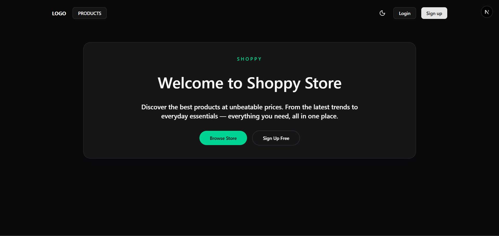
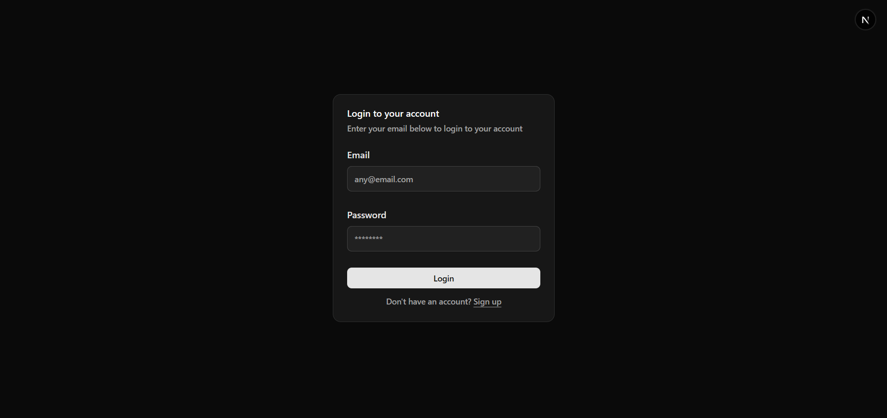
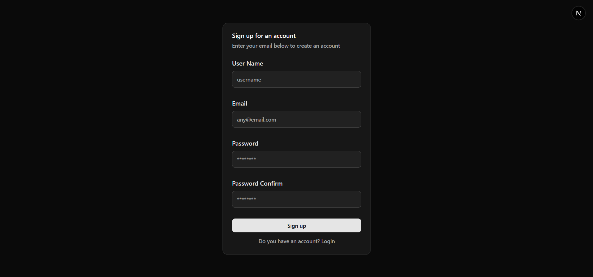
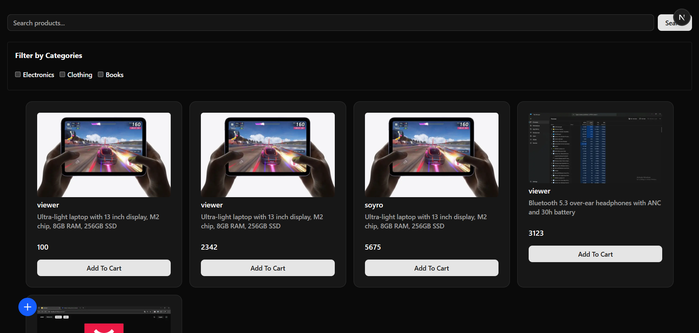
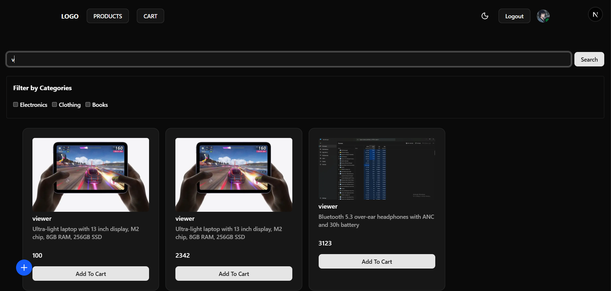
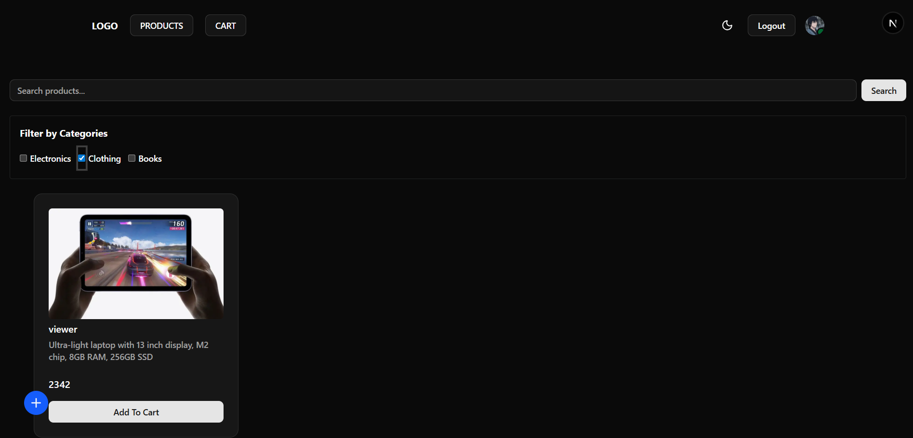
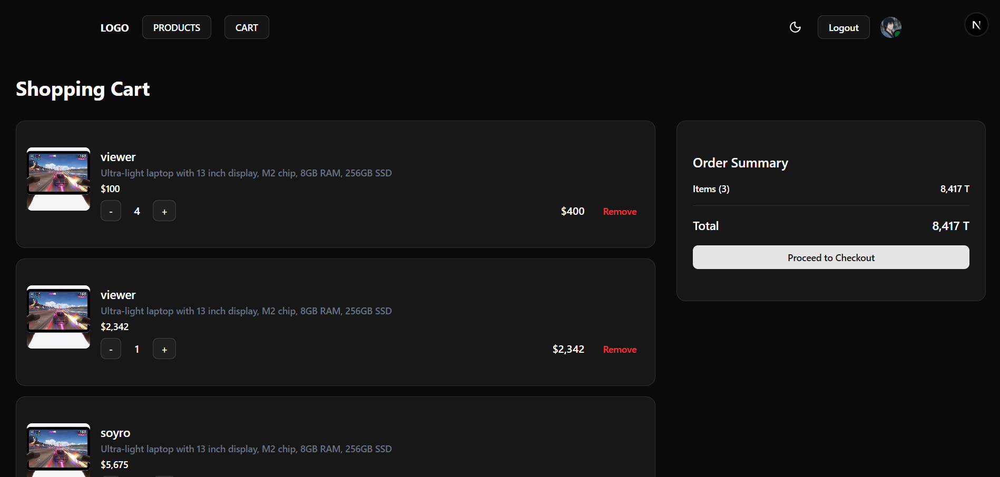
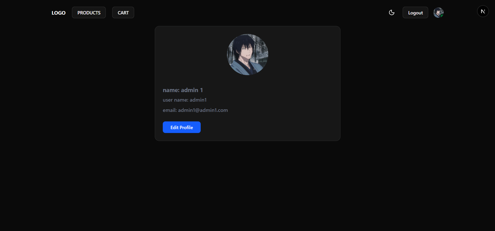
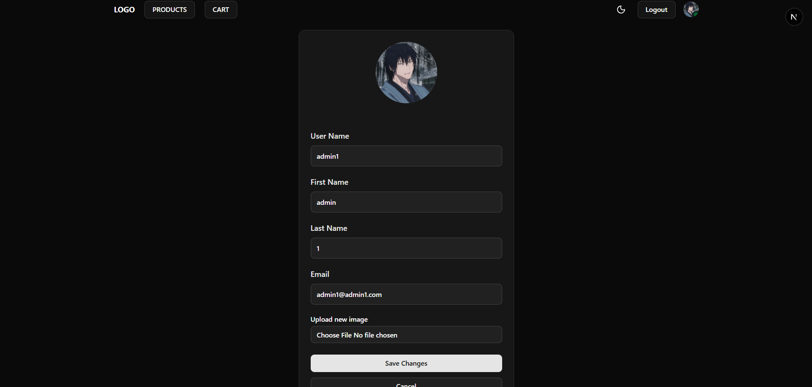
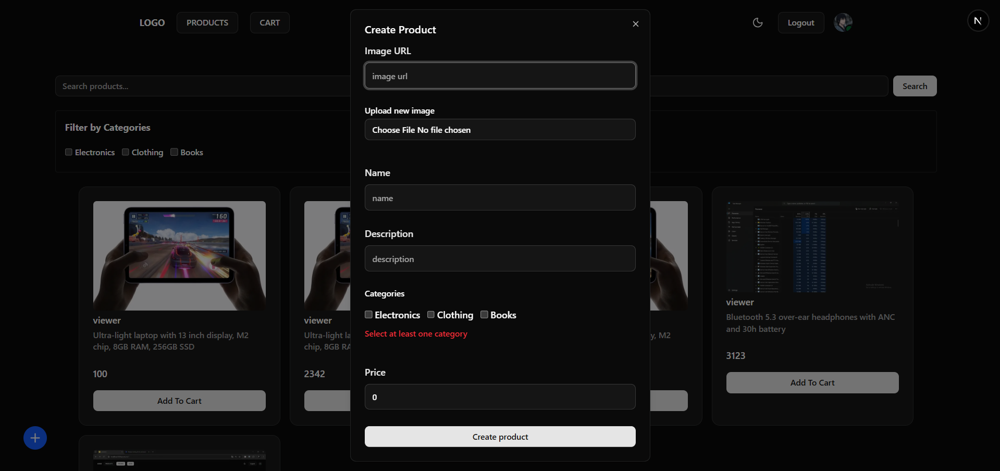

# Shoppy

A full-stack e-commerce application with a Next.js frontend and a Go backend, featuring product browsing, cart management, user authentication, and image uploads to AWS S3.

## Features

- **Product listing** – browse products, filter by category, and search by name
- **Cart** – add/remove items, view cart summary
- **Authentication** – register and login with JWT-based auth
- **Profile management** – view and edit user profile
- **Product creation** – add new products with image upload (S3)
- **Responsive UI** – built with Shadcn UI components and a dialog/sheet for quick actions

## Tech Stack

### Frontend

- **Next.js** (App Router)
- **TypeScript**
- **Zod** (schema validation)
- **Shadcn UI** (UI components)
- **pnpm** (package manager)

### Backend

- **Go**
- **Fiber** (HTTP framework)
- **GORM** (ORM)
- **JWT** (authentication)
- **PostgreSQL** (database)
- **AWS S3** (image storage)

## Screenshots

### Home Page

<p align="center">  </p>

### Products

  

### Cart



### Profile

 

### Create Product



_(Replace the paths above with your actual screenshots)_

## Getting Started

### Prerequisites

- Node.js 18+ and pnpm
- Go 1.21+
- PostgreSQL database
- AWS S3 bucket (or compatible storage)

### Environment Variables

**Frontend** (create a `.env` file in the frontend folder):

GO_API_URL="http://localhost:8000"
JWT_SECRET=secret

PARSPACK_ACCESS_KEY=your_access_key
PARSPACK_SECRET_KEY=your_secret_key
PARSPACK_ENDPOINT=your_endpoint
PARSPACK_BUCKET_NAME=c675240
PARSPACK_REGION=your_bucket
PARSPACK_S3_PATH_STYLE=true

### Installation & Running

1. **Clone the repository**
   ```bash
   git clone https://github.com/reppo-dev/shoppy.git
   cd shoppy
   ```

Backend

cd backend
go mod tidy
go run main.go

Frontend

cd frontend
pnpm install
pnpm dev

shoppy/
├── frontend/ # Next.js app
│ ├── app/
│ ├── components/
│ ├── lib/
│ └── ...
├── backend/ # Go Fiber app
│ ├── main.go
│ ├── handlers/
│ ├── models/
│ ├── routes/
│ └── ...
└── screenshots/ # App screenshots
